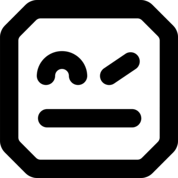
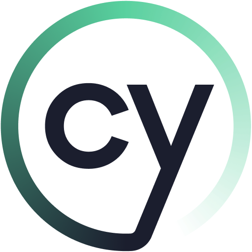

# Olá, me chamo Eneri! 👋

Sou **Quality Assurance Engineer** apaixonado por tecnologia, qualidade de software e automação.

Tenho experiência com testes funcionais, automação de testes, APIs, CI/CD e ambientes cloud, atuando também como Analista de Suporte no início da carreira, o que fortaleceu minha visão sistêmica e foco na experiência do usuário.

Atualmente estou focado em:

- Automação de Testes
- Qualidade de Código
- DevOps
- Inteligência Artificial aplicada a QA
- InnerSource
- Integração Contínua
- Observabilidade
- Arquitetura de Testes

Acredito que a tecnologia é uma ferramenta poderosa para transformar o mundo e melhorar a vida das pessoas. Estou sempre buscando aprender novas práticas e evoluir continuamente.

---

## Ferramentas e Tecnologias

  
  
  
  
  
  
  
  
  
  
  
  
  

## Inteligência Artificial aplicada a QA

Atualmente estudo e desenvolvo soluções utilizando **LLMs** para apoiar processos de qualidade de software:

- revisão automatizada de código
- sugestão de melhorias seguindo boas práticas (Clean Code, SOLID)
- geração de casos de teste
- análise de cobertura de testes
- apoio na documentação técnica
- automação de validações em pipelines CI/CD
- análise de logs com IA

Ferramentas exploradas:

- OpenAI API
- CrewAI
- LiteLLM
- GitHub Copilot
- ChatGPT
- Gemini
- automação de fluxos com IA

---

## O que estou estudando atualmente

- Test Architecture
- Clean Code
- SOLID
- TDD e BDD
- Clean Architecture
- Observabilidade
- Estratégias de testes em microserviços
- Testes de API
- CI/CD pipelines
- AI Agents
- LLMOps

---

## Projetos em destaque

🔹 Agente de revisão de código com IA  
🔹 Automação de testes de API  
🔹 Estrutura de testes baseada em boas práticas  
🔹 Integração de pipelines com validação de qualidade  
🔹 Experimentação com LLMs aplicados a qualidade de software  

---

## Estatísticas GitHub

---

## Contatos

---

⭐ Sempre aberto para colaborar em projetos, trocar conhecimento e evoluir como profissional.
